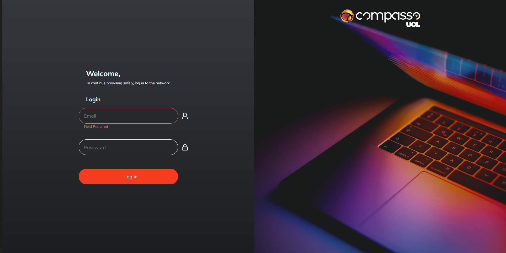

<h4 align="center"> 
	🚧  React 🚀 under construction  🚧
</h4>

## ✨ Functionalities

- 🌈 Login user.
- 📦 Singup user.

## 🎨 Layout

The application layout in figma, you can access by clicking on this link [link](https://www.figma.com/file/bFCO644LzxRZTqyGSLcgzI/Weekly-Planner?node-id=0%3A1&t=Lrpb1g9wJBDBzNiw-0):

<figure>
  <figcaption>Page Login</figcaption>
  
</figure>

## 🔨 Start Project

### Requirements
[Chrome](https://www.google.com/intl/pt-BR/chrome/), [Node.js](https://nodejs.org/en/).

```tsx
# Clone project
$ git clone { url }

# Access project folder in terminal/cmd
$ cd compass-project-pb-react

# Install dependency
$ npm install

# Run an application in development mode
$ npm run dev

# The server will start on port:3000 - go to http://localhost:3000
```

## 🛠 Technology

The following tools were used in building the project:

- [React](https://pt-br.reactjs.org/)
- [TypeScript](https://www.typescriptlang.org/)
- [Node.js](https://nodejs.org/en/)
- [Styled-components](https://styled-components.com/)
- [ViteJS](https://vitejs.dev/guide/)

